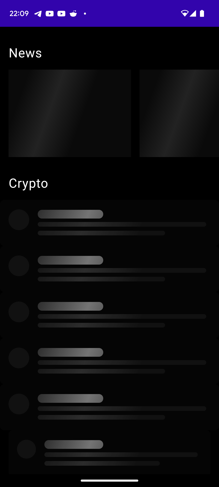
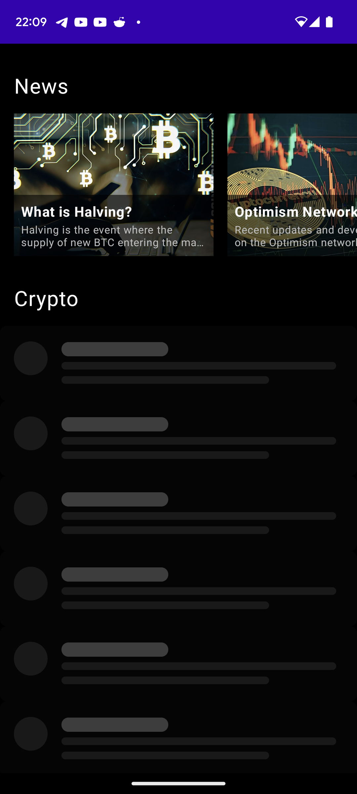
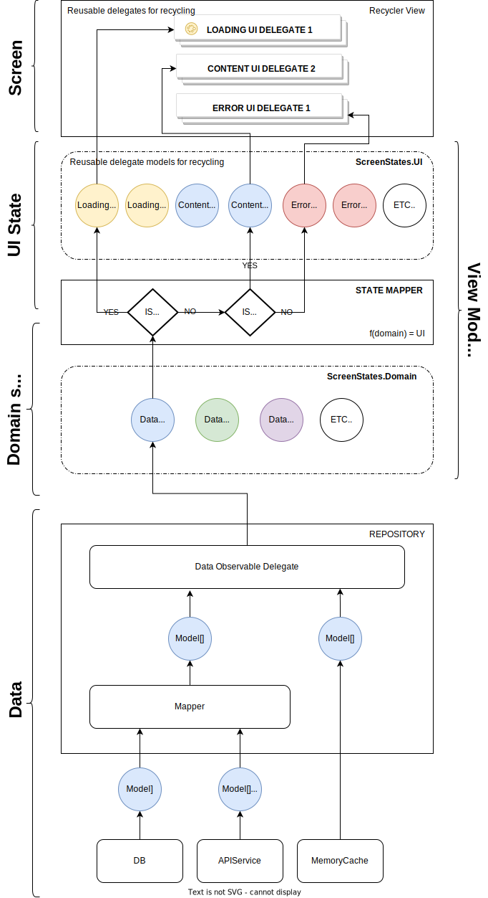

# Abstract

Coinpot is an experimental one-screen app that incorporates open-source frameworks and libraries published by Revolut ([https://github.com/revolut-mobile](https://github.com/revolut-mobile)). The primary objective of this project is to implement a scalable architecture in Android for creating robust user interfaces. The key concepts employed in this app include reactive data flow, MVVM (Model-View-ViewModel) pattern, and UI blocks.

# The app

The app features a scrollable screen that displays two different data feeds: a list of crypto news and a token list. All the content is loaded from a Mocked API, which is similar to the one provided by [coinmarketcap](https://coinmarketcap.com/), and is presented on the main page of the app. By tapping on a news item, the user can open the corresponding news URL in a web browser. Similarly, tapping on a crypto item opens the browser with the URL of the respective crypto token on CoinMarketCap. The user can also pull to refresh the content.

# User Interface

The user interface of the app can be categorized into three states: loading, news loaded, and news & crypto list loaded. The following images illustrate these UI states:

| Loading                               | News Loaded                                         | News & Crypto list Loaded                       |
|---------------------------------------|-----------------------------------------------------|-------------------------------------------------|
|  |  |  |

# Tech stack

The app utilizes the following libraries and frameworks:

| Library/Framework                                                | By who?   | Description                                                            |
|------------------------------------------------------------------|-----------|------------------------------------------------------------------------|
| [Kompot](https://github.com/revolut-mobile/kompot)               | Revolut   | Framework for building android apps with with unidirectional data flow |
| [RxData](https://github.com/revolut-mobile/RxData)               | Revolut   | Reactive data management for Android                                   |
| [RecyclerKit](https://github.com/revolut-mobile/RecyclerKit)     | Revolut   | Simplify RecyclerView setup and management                             |
| [RxJava2](https://github.com/ReactiveX/RxJava)                   | ReactiveX | Reactive programming for Java                                          |
| [Retrofit](https://github.com/square/retrofit)                   | Square    | Type-safe HTTP client for Android and Java                             |
| [Room](https://developer.android.com/training/data-storage/room) | Android   | SQLite database library with ORM features for Android                  |

# Architecture

The app follows an MVVM architecture with a reactive data flow. The key components are illustrated in the diagram below:



All the UI elements of the app are located in the ui/components package. Following the principle of complete recycling of elements, the app utilizes reusable UI components that serve as delegates for RecyclerView or decorators for those delegates. This approach enables each screen to be represented as a single RecyclerView, composed of the appropriate combination of these elements. For instance, the listing screen is structured as follows:

| Data   | Domain State     | Delegate (reusable UI component)         | Observations                                                                                                                                                   |
|--------|------------------|------------------------------------------|----------------------------------------------------------------------------------------------------------------------------------------------------------------|
| News   | Loading          | TitleAndSubtitleOverImageShimmerDelegate | This delegate uses a hardcoded list of 3 Shimmer models, which are created in the domain to UI state mapper. The delegate's view implements a com.facebook.shimmer.ShimmerFrameLayout. |
| Tokens | Loading          | ImageWithTitleAndSubtitleShimmerDelegate | This delegate uses a hardcoded list of 6 Shimmer models, which are created in the domain to UI state mapper. The delegate's view implements a com.facebook.shimmer.ShimmerFrameLayout. |
| News   | Success / Loaded | TitleAndSubtitleOverImageDelegate        | Each News model is mapped to a TitleAndSubtitleOverImageDelegate.Model in the listing state mapper class.                                                           |
| Tokens | Success / Loaded | ImageWithTitleAndSubtitleDelegate        | Each Token model is mapped to an ImageWithTitleAndSubtitleDelegate.Model in the listing state mapper class.                                                          |

In summary, the entire screen can be interpreted as a function:

```
fn(ListingScreenContract.DomainState) = ListingScreenContract.UIState
```

Here, the `DomainState` is a unified class that represents the aggregated sources of data utilized by the screen:

```
data class DomainState(
 val news: LoadableState<List<News>>,
 val tokens: LoadableState<List<Token>>
) : ScreenStates.Domain
```

On the other hand, the `UIState` is a unified class that represents the aggregated UI models of the components required by the screen to render itself:

```
data class UIState(
 val newsTitle: TitleH1Delegate.Model,
 val newsList: HorizontalListDelegate.Model,
 val cryptoTitle: TitleH1Delegate.Model,
 val cryptoList: List<ImageWithTitleAndSubtitleDelegate.Model>,
 val cryptoListShimmer: List<ImageWithTitleAndSubtitleShimmerDelegate.Model>,
 val isLoading: Boolean
) : ScreenStates.UI
```

# Data mocking

The app utilizes the `RetroMock` library to mock each API network call. The mock data is stored in JSON files within the `assets` folder. The mock data is loaded into memory and used to create mock response objects, which Retrofit uses to simulate network calls.

# References

- [https://medium.com/revolut/building-new-features-using-recyclerview-only-aa7db3d8f282](https://medium.com/revolut/building-new-features-using-recyclerview-only-aa7db3d8f282)
- [https://revolutapp.medium.com/the-fundamentals-of-android-at-revolut-544bfc9864f6](https://revolutapp.medium.com/the-fundamentals-of-android-at-revolut-544bfc9864f6)
- [https://medium.com/revolut/reactive-data-flow-in-revolut-android-app-30a49fa1572e](https://medium.com/revolut/reactive-data-flow-in-revolut-android-app-30a49fa1572e)
